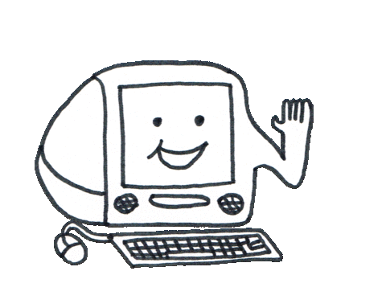
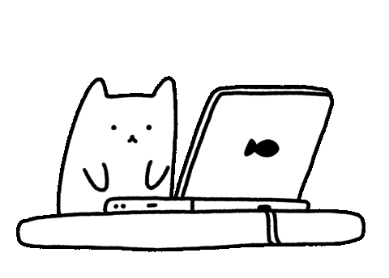

<h1 align="center"><b>Hi, I'm Serena! </b><picture></picture></h1>

 

## <picture></picture> About me

 

- I'm Serena, a prepenultimate Advanced Computing student at the University of Sydney. I love music, marine biology and all things mathematical!

- Although I only started programming in February, I've developed a solid understanding of Python and R. In my free time, I'm currently learning Java and C++ as well as teaching myself about trading.

- I'm always looking to contribute to various projects and collaborate with others! You can contact me at <a href="mailto:serenazhuoyanli@protonmail.com">serenazhuoyanli@protonmail.com or come say hi to me on Discord.
 
